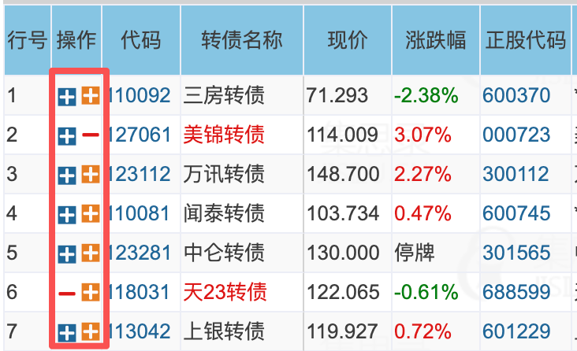

# jisilu-deck

为集思录免费用户增加浏览器本地自选功能的 Chrome 扩展。

## 为什么做

项目发起时，集思录免费账号的站内自选最多只能保存 10 项。对于只需要扩大可转债或 QDII 关注列表、不需要其他会员功能的用户，仅为增加自选数量每月支付数十元会员订阅并不划算。

jisilu-deck 在页面原有操作按钮右侧增加一套独立的本地自选：橙色 `+` 用于加入，红色 `-` 用于移出。记录只保存在当前浏览器中，因此本地自选数量不受站内 10 项额度限制。

扩展不会修改集思录账号的自选额度，不会解锁会员功能，也不会访问受登录或付费权限保护的数据。

## 功能效果



红框内每组图标的左侧是集思录原有操作按钮，右侧是 jisilu-deck 新增的本地自选按钮。右侧橙色 `+` 表示加入本地自选，红色 `-` 表示已加入并可点击移出。

## 功能

- 在可转债列表操作列中增加独立的本地 `+`／`-` 按钮。
- 在 QDII 的欧美市场、商品、亚洲市场三张表中分别增加独立的本地 `+`／`-` 按钮。
- 加入本地自选后，将当前转债名称标记为红色。
- 在页面顶部增加“仅看本地自选”，只显示当前站内筛选结果中的本地自选。
- QDII 每张表都在站内“仅看自选”右侧增加同风格的“仅看本地自选”复选框；三类数据和筛选状态互不影响。
- 页面刷新、表格重渲染和浏览器重启后恢复本地状态。
- 数据仅保存在 `chrome.storage.local`，不提供云同步。
- 不主动请求集思录接口，不读取或保存行情字段。

## 安装

1. 下载本仓库源码并解压。
2. 在 Chrome 打开 `chrome://extensions`。
3. 开启右上角“开发者模式”。
4. 点击“加载已解压的扩展程序”，选择本仓库根目录。
5. 打开 [集思录可转债列表](https://www.jisilu.cn/web/data/cb/list) 或 [集思录 QDII 页面](https://www.jisilu.cn/data/qdii/#qdiie)。

更新源码后，需要在 `chrome://extensions` 中点击扩展的“重新加载”按钮。

## 使用

- 页面原有按钮位于左侧，本地按钮位于右侧。
- 点击橙色 `+`：把当前转债加入本地自选，按钮变为红色 `-`，转债名称同步变红。
- 点击红色 `-`：从本地自选移出当前转债，按钮和名称恢复原状态。
- 点击“仅看本地自选”：开启后只显示本地自选行，再次点击恢复站内当前结果。
- 在 QDII 页，欧美市场、商品、亚洲市场分别维护自己的本地自选；勾选某张表的“仅看本地自选”只筛选该表。
- 鼠标悬停按钮可以查看“加入本地自选”或“移出本地自选”提示。

## 数据与权限

扩展只申请 `storage` 权限。为了在集思录数据板块的 SPA 导航中从其他品种切回可转债后恢复按钮，内容脚本加载范围为：

```text
https://www.jisilu.cn/web/data/cb/*
https://www.jisilu.cn/data/*
```

在 `/data/*` 页面中，插件只处理 QDII 三张目标表，或等待页面内导航返回可转债；不会向封闭基金、债券或其他品种表格注入按钮或读取其数据。

每条本地自选只保存以下字段：

- `bondCode`：可转债代码。
- `bondName`：可转债名称。
- `createdAt`：加入时间。

QDII 记录独立保存 `fundCode`、`fundName` 和 `createdAt`，并按欧美市场、商品、亚洲市场分类隔离。

扩展不会保存持仓、价格、涨跌幅、账号信息或 Cookie，也不会主动向集思录或第三方服务发送请求。卸载扩展会同时清除 `chrome.storage.local` 中的本地自选数据。

## 已知限制

- 支持集思录可转债列表，以及 QDII 欧美市场、商品、亚洲市场三张表。
- 本地自选不会在不同浏览器或设备之间同步。
- 暂不提供批量管理、导入导出、备注、持仓或独立管理页面。
- 插件依赖目标页面当前的 DOM 结构和图标字体；集思录改版后可能需要更新适配逻辑。


## 开发与测试

项目使用原生 Manifest V3 和 JavaScript，没有运行时第三方依赖。

```bash
node --test
```

真实页面 E2E 使用 `browser-skill` 的 `bsk` CLI 驱动已连接的 Chrome。完成环境配置并重新加载扩展后运行：

```bash
node tools/e2e-cb-list.js
node tools/e2e-qdii.js
```

E2E 会临时加入初始为未选状态的记录，并在结束前恢复原状态。详细产品、架构和验证设计见 [`docs/`](docs/)，当前进度见 [`ROADMAP.md`](ROADMAP.md)。

## 免责声明

本项目是独立的开源浏览器扩展，与集思录无隶属、合作或授权关系。使用者应自行遵守目标网站的服务条款。本项目不提供投资建议，也不保证目标页面改版后的持续兼容性。

## License

本项目采用 [MIT License](LICENSE)。
